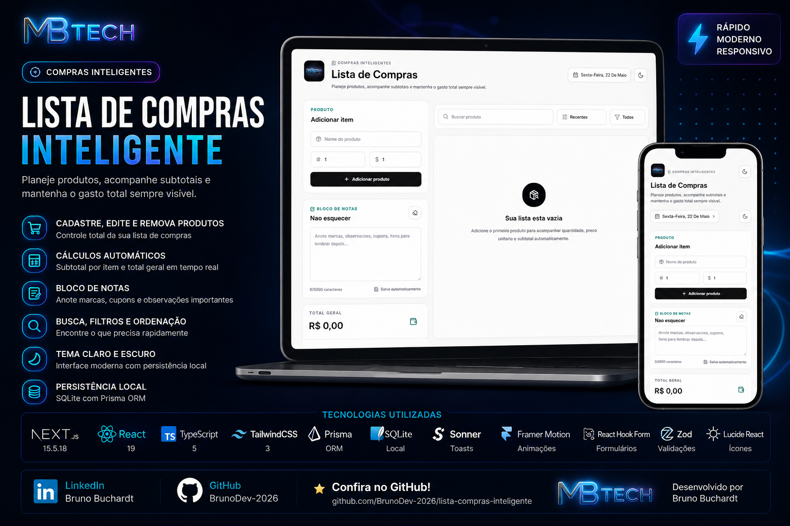

# Lista de Compras Inteligente

Aplicação web moderna para controle pessoal de compras, com visual SaaS premium, responsividade real, cálculos automáticos e persistência local com SQLite.




## Links

[](https://www.linkedin.com/in/bruno-buchardt-721643246)
[](https://github.com/BrunoDev-2026)

## Funcionalidades

- Cadastro, edição e remoção de produtos.
- Cálculo automático de subtotal por item.
- Total geral atualizado em tempo real.
- Bloco de notas livre para lembrar itens, marcas, cupons e observações.
- Busca instantanea de produtos.
- Filtros e ordenação.
- Tema claro e escuro com persistencia local.
- Toasts de feedback com Sonner.
- Loading skeleton e estados vazios elegantes.
- Layout responsivo para desktop, tablet e mobile.
- API REST com persistencia em SQLite.

## Ferramentas Utilizadas

- Next.js 15+
- React 19
- TypeScript
- TailwindCSS
- Prisma ORM
- SQLite
- Lucide React
- Framer Motion
- React Hook Form
- Zod
- Sonner
- next/font/google com fonte Inter
- ESLint

## Como Executar

Instale as dependencias:

```bash
npm install
```

Gere o Prisma Client:

```bash
npm run prisma:generate
```

Inicialize o banco SQLite:

```bash
npm run db:init
```

Inicie o servidor de desenvolvimento:

```bash
npm run dev
```

Acesse no navegador:

```text
http://localhost:3000
```

No Windows, caso o PowerShell bloqueie `npm`, use:

```bash
npm.cmd run dev
```

## Banco de Dados

O projeto usa SQLite com Prisma. Os modelos principais ficam em `prisma/schema.prisma`.

```prisma
model ShoppingItem {
  id        Int      @id @default(autoincrement())
  name      String
  quantity  Int
  price     Float
  createdAt DateTime @default(now())
}

model ShoppingNote {
  id        Int      @id @default(1)
  content   String   @default("")
  updatedAt DateTime @updatedAt
}
```

## Estrutura do Projeto

```text
prisma/
src/app/
src/components/
src/hooks/
src/lib/
src/types/
src/validations/
public/brand/
scripts/
```

## Autor

Desenvolvido por Bruno Buchardt.

[](https://www.linkedin.com/in/bruno-buchardt-721643246)
[](https://github.com/BrunoDev-2026)
